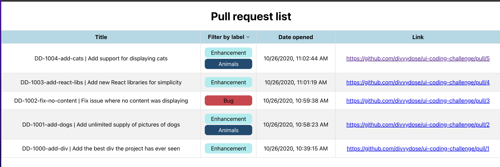
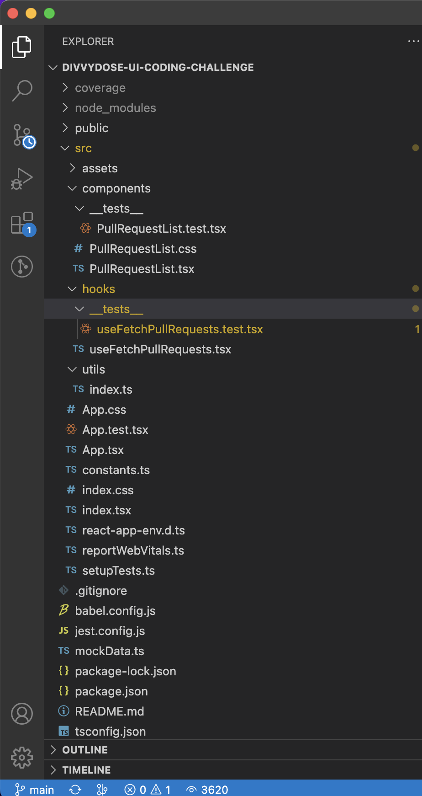
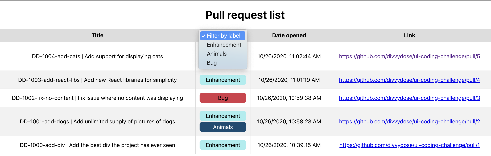
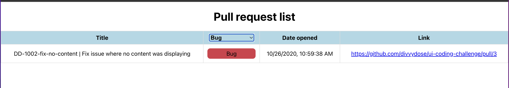

# Divvydose ui coding challenge

I used create react app + typescript to get started quickly. Since this is a small application I structured the folder very easily. I have components, hooks, assets and utils folder. All the folder names are lower cased. The components and main application files are capitalized but the rest are lower cased. App.tsx file renders all the components. It calls the useFetchPullRequest hook to fetch the PRs. Since it's a small app I chose prop drilling to pass the state instead of using redux or useContext for global state management. PullRequestList.tsx has all the logic and table for displaying the returned PRs. I have two utils functions that help with date formatting and capitalizing the first letter of a string. I added a few tests throughout the application.

# Table

Here we see a table with 4 headers (Title, All labels, Date opened, Link) and list of PRs. To filter by a specific label, you need to click on "All labels" header and a dropdown menu will appear. Select the desired label and it will only show you the PRs with the selected label.

# Test coverage

Test coverage is over 93 percent of lines.

# Getting Started with Create React App

This project was bootstrapped with [Create React App](https://github.com/facebook/create-react-app).

## Available Scripts

In the project directory, you can run:

### `npm start`

Runs the app in the development mode.\
Open [http://localhost:3000](http://localhost:3000) to view it in the browser.

The page will reload if you make edits.\
You will also see any lint errors in the console.

### `npm test`

Launches the test runner in the interactive watch mode.\
See the section about [running tests](https://facebook.github.io/create-react-app/docs/running-tests) for more information.

### `npm run build`

Builds the app for production to the `build` folder.\
It correctly bundles React in production mode and optimizes the build for the best performance.

The build is minified and the filenames include the hashes.\
Your app is ready to be deployed!

See the section about [deployment](https://facebook.github.io/create-react-app/docs/deployment) for more information.
